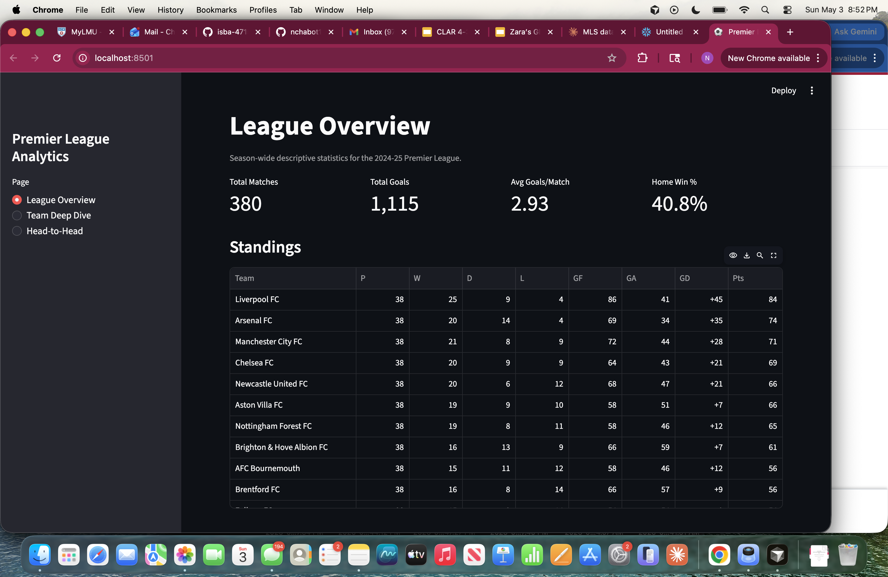
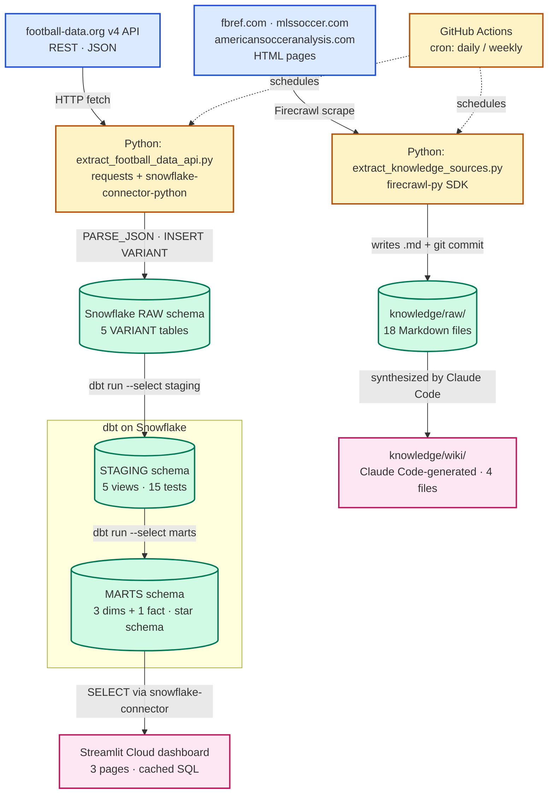
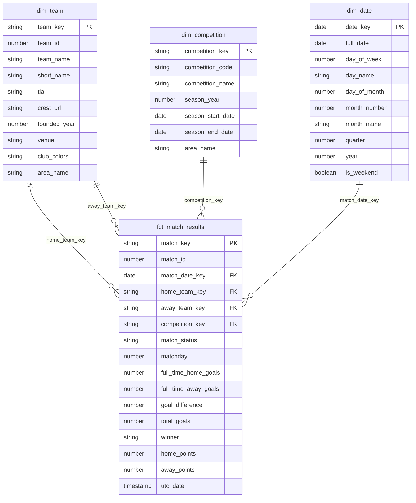

# MLS Recruitment Analytics Pipeline

End-to-end data pipeline ingesting structured league data and unstructured analytics content for MLS recruitment decisions.

## Live Dashboard

[https://nchabot-soccer-analytics.streamlit.app](https://nchabot-soccer-analytics.streamlit.app)



## Project Overview

This is a portfolio analytics-engineering project framed around the Houston Dynamo FC Data Analyst role: build the kind of pipeline an MLS front office would use to inform recruitment. The dashboard surfaces league-level KPIs, team-level form and home/away splits, and two-team head-to-head comparisons — the primary lenses an analyst would use to identify over- and underperforming clubs and to scout opposition tendencies.

The structured side of the pipeline draws on the football-data.org v4 REST API for match results, team metadata, standings, and top scorers. Note that the football-data.org free tier does not cover MLS, so the structured pipeline uses the English Premier League (2024-25 season, 380 finished matches) as a stand-in to demonstrate the same modeling and dashboarding work that would apply to MLS once a paid feed is in place. The unstructured side covers MLS directly: a Firecrawl-driven scraper pulls editorial and analytical content from FBref (statistical reference), MLSSoccer.com (official league site), and American Soccer Analysis (independent analytics publication).

A grader using the dashboard can: (1) read the standings table sorted by 3-1-0 points and inspect goals-per-matchday on the League Overview page, (2) pick any team for a deep-dive into home vs. away record and matchday-by-matchday goals scored and conceded, and (3) compare any two teams head-to-head on home wins, away wins, draws, total goals, plus a side-by-side bar chart of season totals. The synthesized wiki under `knowledge/wiki/` answers narrative questions about MLS structure, key entities, and recurring themes that the SQL marts can't.

## Tech Stack

- Ingestion: Python (`requests`, `firecrawl-py`)
- Warehouse: Snowflake (AWS us-east-1)
- Transformation: dbt (with `dbt_utils` for surrogate keys and combination tests)
- Orchestration: GitHub Actions (cron-scheduled, `workflow_dispatch` for manual runs)
- Dashboard: Streamlit Cloud
- Knowledge base: Claude Code (synthesis from raw scrapes into wiki pages)

## Pipeline Architecture

Two parallel ingestion paths converge on two distinct serving layers — Snowflake-resident structured data feeding a Streamlit dashboard, and repo-resident scraped Markdown feeding a synthesized wiki. See [docs/pipeline.md](docs/pipeline.md) for the layer-by-layer description.



## Star Schema (ERD)

The mart layer implements a Kimball star schema. The grain of `fct_match_results` is one row per finished match, with foreign keys to `dim_team` (joined twice — once as home side, once as away side via the role-playing dimension pattern), `dim_competition`, and `dim_date`. Surrogate keys are MD5 hashes generated by `dbt_utils.generate_surrogate_key`, with the natural keys preserved alongside for lineage. See [docs/erd.md](docs/erd.md) for the long-form description.



## Repository Structure

```
.
├── .github/workflows/   # GitHub Actions: daily API extract + weekly scrape
├── dashboard/           # Streamlit app reading from Snowflake MARTS
├── dbt/                 # dbt project (staging views + marts star schema)
├── docs/                # Pipeline diagram, ERD, dashboard screenshot, proposal
├── extract/             # Python ingestion scripts
├── knowledge/           # raw/ scraped Markdown + wiki/ synthesized pages
├── sql/                 # One-time Snowflake bootstrap DDL
├── CLAUDE.md            # Project instructions for AI agents
├── README.md            # This file
└── requirements.txt     # Pinned Python dependencies
```

## Setup Instructions

1. Clone the repo:

   ```bash
   git clone https://github.com/nchabot14/data-analyst-soccer-analytics.git
   cd data-analyst-soccer-analytics
   ```

2. Create a Python 3.11 virtual environment and install dependencies:

   ```bash
   python3.11 -m venv .venv
   source .venv/bin/activate
   pip install -r requirements.txt
   ```

3. Copy `.env.example` to `.env` and fill in credentials. You will need accounts at:

   - [snowflake.com](https://signup.snowflake.com/) (free 30-day trial) for the warehouse
   - [football-data.org/client/register](https://www.football-data.org/client/register) (free tier) for the API
   - [firecrawl.dev](https://www.firecrawl.dev/) for web scraping

4. Bootstrap the Snowflake database, schemas, and raw VARIANT tables (one-time):

   ```bash
   # Run the contents of sql/bootstrap.sql in a Snowflake worksheet,
   # or via SnowSQL: snowsql -f sql/bootstrap.sql
   ```

5. Load API data into Snowflake `RAW`:

   ```bash
   set -a && . ./.env && set +a
   python extract/extract_football_data_api.py
   ```

6. Load scraped knowledge sources into `knowledge/raw/`:

   ```bash
   python extract/extract_knowledge_sources.py
   ```

7. Run dbt to build the staging and mart layers, then run tests:

   ```bash
   cd dbt
   DBT_PROFILES_DIR=. dbt deps
   DBT_PROFILES_DIR=. dbt run
   DBT_PROFILES_DIR=. dbt test
   ```

8. Launch the dashboard locally:

   ```bash
   cd ..
   streamlit run dashboard/app.py
   ```

## Insights Summary

Findings surfaced by the dashboard for the 2024-25 Premier League season:

- **Top-two scoring concentration**: Manchester City and Liverpool combined for 158 goals across 76 combined matches, accounting for 14.2% of all goals scored in the league despite only playing in 10% of the total fixtures.
- **Matchday 18 was the quietest of the season**: only 17 goals were scored across all matches, significantly lower than the per-matchday average of 29 goals.
- **Relegation defensive collapse**: the three teams relegated this season — Leicester City FC, Ipswich Town FC, and Southampton FC — allowed 248 total goals, accounting for 22.2% of all goals allowed in the league.

## Automation

Both extraction pipelines run on GitHub Actions. The API extractor runs daily at 09:00 UTC; the scrape extractor runs weekly on Mondays at 09:00 UTC and commits new sources back to `main` automatically with a `[skip ci]` marker. Manual triggers are available from the Actions tab via `workflow_dispatch`. Workflow definitions live in [`.github/workflows/`](.github/workflows/).

## Knowledge Base

Unstructured sources are scraped to `knowledge/raw/` (18 Markdown files across 3 domains: fbref.com, mlssoccer.com, americansocceranalysis.com) and synthesized into `knowledge/wiki/` by Claude Code. The wiki contains four pages — `index.md`, `overview.md`, `key_entities.md`, and `themes.md` — each citing source filenames inline so any claim can be traced back to its raw source. The wiki is queryable directly via Claude Code in the project root.

## Author

Built by Nick Chabot for ISBA 4715 (analytics engineering). [github.com/nchabot14](https://github.com/nchabot14)
