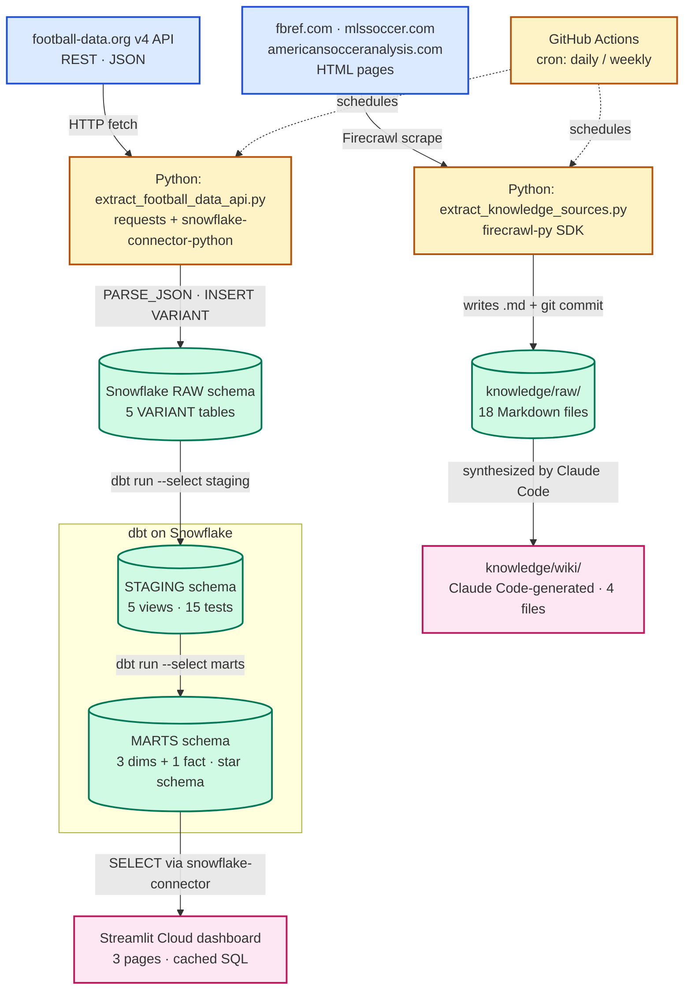

# data-analyst-soccer-analytics

## Pipeline Architecture

This project ingests MLS data through two parallel pipelines — a structured football-data.org REST API and Firecrawl-driven web scraping — that converge on a Snowflake star schema serving a Streamlit dashboard, plus a synthesized wiki for analyst queries. See [docs/pipeline.md](docs/pipeline.md) for the full layer-by-layer description.

