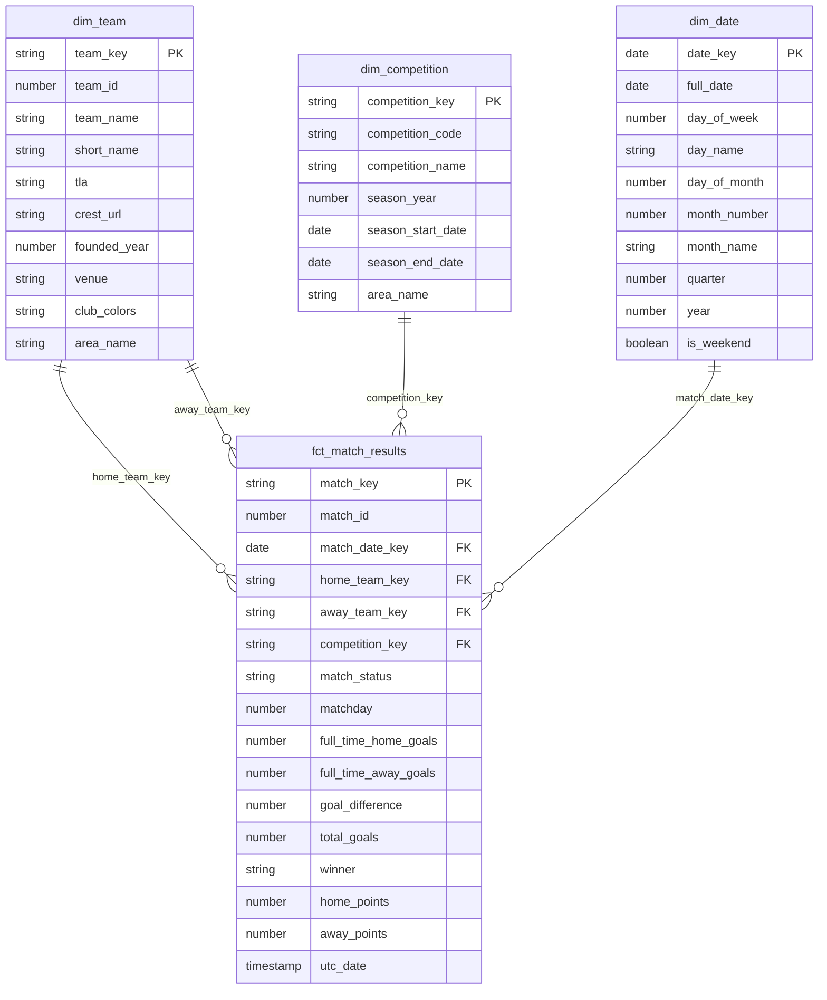

# Star Schema ERD

## Overview

The mart layer implements a classic Kimball star schema centered on `fct_match_results`, the only fact table. The grain of the fact is **one row per finished match** — every row represents a single completed fixture from football-data.org. Three dimensions hang off the fact: `dim_team` (joined twice, once via `home_team_key` and once via `away_team_key`), `dim_competition` (one row per competition+season), and `dim_date` (a 731-day spine where the date itself serves as the primary key). Surrogate keys are generated with `dbt_utils.generate_surrogate_key` (md5 hashes) so that joins are stable even if the underlying natural keys ever change types or formats; the natural keys are kept alongside for lineage. This shape is what makes BI questions like "home points vs. away points per team across the 2024-25 season" answerable with a single fact-to-dim join.

## Diagram

