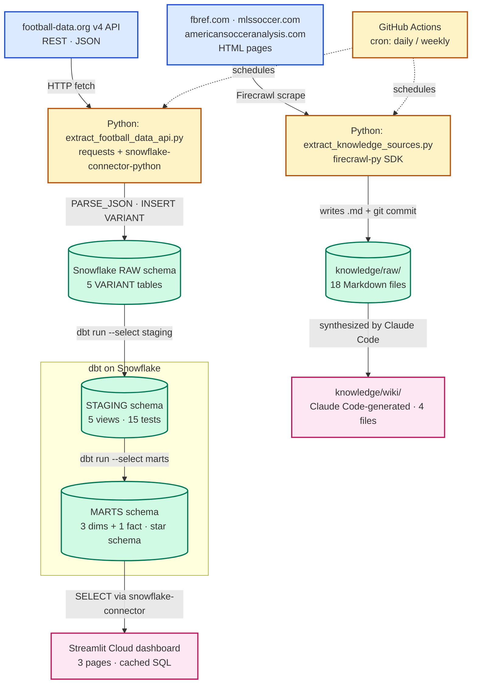

# Data Pipeline Architecture

This project ingests Major League Soccer data through two parallel pipelines that converge on two distinct serving layers. Structured match, team, player, and standings data flows from the **football-data.org v4 REST API** through a Python extractor into a Snowflake `RAW` schema, where dbt then promotes it through a `STAGING` view layer (with tests) into a `MARTS` star schema that backs a **Streamlit Cloud dashboard**. Unstructured editorial and analytical content is scraped from three public websites by a separate Python extractor (using the **Firecrawl** SDK) and written to `knowledge/raw/` as Markdown files; those files are synthesized into a wiki under `knowledge/wiki/` for grader and analyst queries. Both extractors are orchestrated by **GitHub Actions** on cron schedules — daily for the API extract, weekly for the scrape — with the scrape workflow committing its output back to `main` automatically.

## Pipeline diagram

## Layer descriptions

### 1. Sources
External systems the pipeline depends on but does not control.

- **football-data.org v4 API** — free-tier REST API (10 req/min), returns JSON for competitions, teams, matches, standings, and top scorers. Authentication via `X-Auth-Token` header.
- **fbref.com** — Sports Reference's football statistics site; provides MLS competition pages and individual player profiles keyed by 8-character IDs.
- **mlssoccer.com** — the league's official editorial site (about, news, standings, MLS Cup playoffs).
- **americansocceranalysis.com** — independent analytics publication (Squarespace SPA — note: article-body scraping requires JS rendering).

### 2. Extraction
Python scripts that pull from the sources, run by GitHub Actions on a schedule.

- **`extract/extract_football_data_api.py`** — uses `requests` to call the 5 football-data.org endpoints, then `snowflake-connector-python` to `INSERT INTO ... SELECT PARSE_JSON(%s)` against `RAW`. Sleeps 6.5 s between calls to stay under the free-tier rate limit.
- **`extract/extract_knowledge_sources.py`** — uses `firecrawl-py` to scrape each URL in `TARGETS` (currently 18 URLs across 3 domains), writes one Markdown file per URL into `knowledge/raw/` with a YAML front-matter block recording `source_url`, `scraped_at`, and `source` domain. Logs and skips per-URL failures rather than aborting.
- **GitHub Actions** — `extract-football-api.yml` runs daily at 09:00 UTC; `extract-firecrawl-fbref.yml` runs weekly on Mondays at 09:00 UTC and commits scraped output back to `main` with `[skip ci]`. Both have `workflow_dispatch` for manual triggering.

### 3. Raw layer
Land-as-is destinations for unmodified source data, one per ingestion track.

- **Snowflake `SOCCER_RECRUITMENT.RAW`** — 5 tables (`RAW_COMPETITIONS`, `RAW_TEAMS`, `RAW_MATCHES`, `RAW_STANDINGS`, `RAW_SCORERS`), each with a `payload VARIANT` column plus provenance columns (`extracted_at`, `source`, `competition_code`, `season`).
- **`knowledge/raw/`** — 18 Markdown files in the repo, committed to git. Each file is the Firecrawl-rendered Markdown of a single source URL.

### 4. Transformation — dbt on Snowflake
SQL transformation pipeline. All models are version-controlled under `dbt/models/`.

- **`STAGING` schema** — 5 view models (`stg_competitions`, `stg_teams`, `stg_matches`, `stg_standings`, `stg_scorers`) that flatten VARIANT JSON into typed columns using `payload:field::TYPE` syntax and `LATERAL FLATTEN` for arrays. 15 data tests cover uniqueness, null-checks, accepted values, and a combination-uniqueness test (via `dbt_utils`).
- **`MARTS` schema** — 4 table models forming a Kimball star schema: `dim_team` (20 rows), `dim_competition` (1 row), `dim_date` (731-day spine), and `fct_match_results` (380 finished matches). Surrogate keys generated by `dbt_utils.generate_surrogate_key`. 16 mart-level tests including 4 `relationships` tests that verify foreign-key integrity.

### 5. Serving / knowledge layer
Final consumers — what end users (or graders) actually interact with.

- **Streamlit Cloud dashboard** — three pages (League Overview, Team Deep Dive, Head-to-Head) that read from `MARTS.*` via `snowflake-connector-python`. Connection cached with `@st.cache_resource`; query results cached with `@st.cache_data(ttl=600)`. Public URL recorded in `docs/dashboard-url.txt`.
- **`knowledge/wiki/`** — 4 Markdown files (`index.md`, `overview.md`, `key_entities.md`, `themes.md`) synthesized by Claude Code from the contents of `knowledge/raw/`, with strict citation back to source filenames so a grader can verify any claim.
